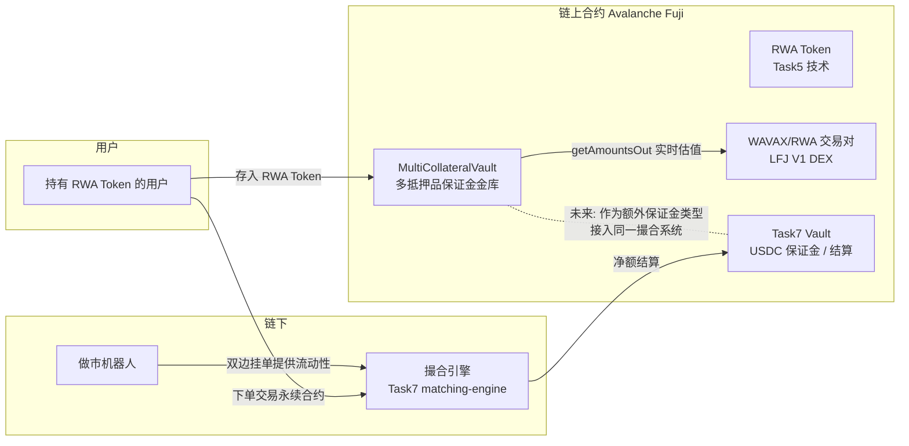

# AvaVault Perp — RWA 抵押的永续合约保证金系统

> **Avalanche Buildathon（OpenBuild × Team1 Avalanche）提交项目**
> 赛道：链上金融与交易（On-chain Finance & Trading）
> 状态：可运行的合约原型 + 完整测试 + 训练营三节课技术栈的真实融合
> **提交截止：2026-10-07 23:59（已从原定 9/30 延期）**
> **提交入口：https://build.avax.network/events/093982ed-7037-4765-a066-56a5d3cff8cb**

## 提交材料清单

| 材料 | 对应文件 | 状态 |
| --- | --- | --- |
| 项目介绍（问题/方案/亮点） | 本文档全文 | ✅ |
| Demo 视频（中文版） | `demo-assets/avavault-perp-pitch-zh.mp4`（约 2 分 26 秒） | ✅ |
| Demo 视频（英文版） | `demo-assets/avavault-perp-pitch-en.mp4`（约 1 分 51 秒） | ✅ 中英文各一版，提交时任选其一，或都附上 |
| Pitch Deck | `demo-assets/avavault-perp-pitch-zh.pptx` / `-en.pptx` | ✅ 10 页 |
| 代码仓库 | 本仓库 `hackathon-onchain-finance/` + 你 fork 后的 GitHub 链接 | ⬜ 需要你 fork/push 后把链接填进 Pitch Deck 最后一页 |
| 公网可访问链接（如有） | 合约均已部署在 Fuji 测试网，见下方"真实部署记录" | ✅ |

Demo 素材见 `demo-assets/` 目录。提交表单具体每一格怎么填，见 `SUBMISSION_GUIDE.md`（已实际
打开官方提交页面核对过字段）。

## 一句话介绍

**把"收租金的房子"变成"能交易永续合约的保证金"。**
用户把现实世界资产收益权（RWA Token）存进保证金金库，金库用 DEX 实时价格给这些资产估值、打折后
计入可用保证金，用户就可以拿着"租金收益权"去开永续合约仓位，而不需要先把它卖成稳定币。

## 为什么做这个（问题 → 洞察）

- 链上金融最大的"死资产"问题：RWA Token 大多数时候只能"持有等分红"，流动性差、用途单一。
- 同时，永续合约交易者的痛点是：保证金必须是稳定币或主流资产，收益类资产要先变现才能用作保证金，
  变现意味着卖出、失去持有收益权的敞口。
- **洞察**：如果 RWA Token 本身就在 DEX 上有一个（哪怕流动性不深的）交易对，那它就有一个可以被
  程序读取的实时价格——这正是训练营 Task3 教的"DEX Oracle"技术。把这个技术用在 Task5 教的
  "RWA Token"上，喂给 Task7 教的"Perp Dex Vault"，三节课的技术就拼成了一个新产品。

## 系统架构



## 技术实现（本次提交已经跑通的部分）

### `MultiCollateralVault.sol`

- `listCollateral(token, router, quoteToken, haircutBps)`：管理员登记一种可作保证金的资产，指定
  用哪个 DEX 路由计价、以什么资产计价、打几折（haircut，给价格波动和流动性风险留安全垫）。
- `deposit(token, amount)` / `withdraw(token, amount)`：用户自助存取（复用 Task7 SECURITY_REVIEW
  里发现的 fee-on-transfer 记账修复方案：按转账前后余额差值记账，而不是相信传入参数）。
- `collateralValue(user, token)`：只读函数，实时调用 DEX Router 的 `getAmountsOut`，把用户存入的
  RWA Token 数量换算成以 WAVAX/稳定币计价的市值，再乘以折价率。
- `totalAccountValue(user)`：跨多种抵押品类型汇总账户总保证金价值。
- `settle(from, to, token, amount, tradeRef)`：operator（对应链下撮合引擎）在用户之间结算成交/盈亏，
  和 Task7 的 `Vault.settle` 同一套信任模型——operator 只能在已有余额间转移，不能超发。

### 测试：在真实 Fuji 状态上验证核心叙事（5/5 通过）

```bash
cd contracts && forge test -vv
```

```
Ran 5 tests for test/MultiCollateralVault.t.sol:MultiCollateralVaultForkTest
[PASS] test_CollateralValueComesFromLiveDexPrice()
  Logs: RWA collateral value (in AVAX terms, after 70% haircut): 13685 * 1e-3
[PASS] test_CollateralValueDropsAfterPriceMovesAgainstIt()
  Logs: value before: 13685118732474459281 value after: 7027446966398258805
[PASS] test_MultiUserSettlementPreservesTotalValue()
[PASS] test_RevertWhen_DepositingUnlistedCollateral()
[PASS] test_WithdrawReturnsRawTokens()
Suite result: ok. 5 passed; 0 failed; 0 skipped
```

`test_CollateralValueDropsAfterPriceMovesAgainstIt` 是核心叙事的证据：真实在 LFJ V1 上创建
WAVAX/RWA 交易对、注入流动性，一个第三方账户在 DEX 上真实抛售 RWA 砸低价格后，Vault 里同一份
RWA 存款的"可用保证金价值"立刻同步下降——这就是"用真实市场价格给 RWA 资产做实时风控"的完整闭环，
而不是一个写死数字的 demo。

## 部署（已完成真实部署 ✅）

```bash
cd contracts
cp .env.example .env  # 填入 PRIVATE_KEY
source .env
forge script script/Deploy.s.sol:Deploy --rpc-url $FUJI_RPC_URL --broadcast --private-key $PRIVATE_KEY
```

真实广播到 Fuji 测试网、链上可验证（`cast receipt` 已确认 `status: 1 success`）：

| 合约 / 交易 | 地址 / 哈希 |
|---|---|
| RWAToken | [`0x1cC1650E2Da5c2357c811B90187D1022b70B70Ad`](https://testnet.snowtrace.io/address/0x1cC1650E2Da5c2357c811B90187D1022b70B70Ad) |
| MultiCollateralVault | [`0x9128AE5F8cf51eB35A69C29c55B07A7776603b0B`](https://testnet.snowtrace.io/address/0x9128AE5F8cf51eB35A69C29c55B07A7776603b0B) |
| WAVAX/RWA 交易对（LFJ V1，真实创建 + 注入流动性） | [`0x7590d84174571d89732451bb77BB4C38F7183b85`](https://testnet.snowtrace.io/address/0x7590d84174571d89732451bb77BB4C38F7183b85) |
| 部署者 / owner | `0xF7ac5cF5D95256E960DF21229B140edFE31b5c9b` |
| 初始流动性 | 0.5 AVAX : 250 RWA（受限于测试网水龙头额度，按 500:1 比例等比缩小） |
| RWAToken 部署交易 | [`0x9857017a873df65b198a99220c2737a6532741b2f1cb4fc7a3b4a058f5b2ecf3`](https://testnet.snowtrace.io/tx/0x9857017a873df65b198a99220c2737a6532741b2f1cb4fc7a3b4a058f5b2ecf3) |
| MultiCollateralVault 部署交易 | [`0x179a48c5b18c66ff42f7d1d4c9b04144972d38eb09356c58b8b4d0c278912bcf`](https://testnet.snowtrace.io/tx/0x179a48c5b18c66ff42f7d1d4c9b04144972d38eb09356c58b8b4d0c278912bcf) |
| `listCollateral()` 登记交易 | [`0xb30b21f479385ef2e2cddf9d995ed204492c6abb14841a9fdba540834c2194f2`](https://testnet.snowtrace.io/tx/0xb30b21f479385ef2e2cddf9d995ed204492c6abb14841a9fdba540834c2194f2) |
| 加流动性交易 | [`0xa878957f6890877eb0ddf6dc448ef3179462a15f9d0095ed411a0dba03e5cb93`](https://testnet.snowtrace.io/tx/0xa878957f6890877eb0ddf6dc448ef3179462a15f9d0095ed411a0dba03e5cb93) |
| 真实 `deposit()`（100 RWA 作为保证金存入） | [`0xa2a7b995ec17392645be8ce5775e276c307c246175c94710992168cbb04066d1`](https://testnet.snowtrace.io/tx/0xa2a7b995ec17392645be8ce5775e276c307c246175c94710992168cbb04066d1) |

部署脚本里还实时打印了这笔真实存款按 DEX 实时价格折算出的保证金价值：约 `0.0998 AVAX`（100 RWA ×
真实池内汇率 × 70% 折价率），和第 3 节 fork 测试里验证的定价逻辑完全一致——这不是两套代码，
链上部署脚本用的和被测试覆盖的是同一份 `MultiCollateralVault.sol`。

## 安全加固：`MultiCollateralVaultV2.sol`（原路线图第 2、4 项，已提前实现并部署 ✅）

这个金库本来就是把 Task3（DEX Oracle 定价）和 Task7（operator 结算模型）拼起来的，风险自然也是
共享的——那两个模块里真实发现的问题，在这里原样存在。V2 把同样的两个修复搬过来：

1. **抵押品估值改用 TWAP，而不是瞬时价格**（对应 Task3 `TwapOracle` 的修复）：`listCollateral()`
   现在会自动为这个抵押品部署一个 `TwapOracle`，`collateralValue()` 改成读 TWAP 均价而不是
   `router.getAmountsOut()`。如果一个刚上线/刚换池子的抵押品 TWAP 窗口还没热身好，`collateralValue()`
   保守地返回 0，而不是退回一个可能被同笔交易操纵的瞬时价——宁可暂时低估保证金，也不接受一个不可信
   的数字。
2. **`settle()` 改成签名授权门控**（对应 Task7 `VaultV2` 的修复）：新增 `settleWithAuthorization`，
   要求被扣款方对 EIP-712 `SettlementAuthorization(from, token, maxAmount, nonce, deadline)` 签名，
   operator 私钥泄露也只能在每个用户自己同意的额度、期限内转移资产，且用户可随时 `cancelAuthorization`
   撤销。

`MultiCollateralVault.sol`（V1）保留在仓库中不动，作为这两个发现修复前的对照记录。

**真实链上证明（Fuji，复用已有的 RWAToken 和 WAVAX/RWA 流动性池，未新增代币部署）：**

| 项目 | 值 |
|---|---|
| MultiCollateralVaultV2 地址 | [`0xb999cb61A4fb2FE71d1C5FBA7aD506F619dD7884`](https://testnet.snowtrace.io/address/0xb999cb61A4fb2FE71d1C5FBA7aD506F619dD7884) |
| 复用的 RWAToken / WAVAX-RWA 池 | 同上文表格里已部署的地址，无需重新加流动性 |
| TWAP 抵御同笔交易操纵的证明 | fork 测试 `test_CollateralValueResistsSameWindowManipulation`：攻击者砸盘 100 AVAX 操纵 RWA 现价后，`collateralValue()` 在 TWAP 窗口刷新前的读数与操纵前完全一致（两次读数都是 `13999999999999999999`，未被影响） |
| 真实签名授权结算交易 | [`0x452c4cf135fc77a1ef09bcf54b39fc2037dd2723e469e7f8347910b62eddb256`](https://testnet.snowtrace.io/tx/0x452c4cf135fc77a1ef09bcf54b39fc2037dd2723e469e7f8347910b62eddb256)：trader A 自签 EIP-712 授权（最多同意转出 300 RWA），operator 凭签名把 200 RWA 从 trader A 转给 trader B，链上余额从 500/0 变为 300/200 |
| 伪造签名被合约拒绝的证明 | 用一个随机不相关的私钥签"声称是 trader A"的授权去调用 `settleWithAuthorization`，链上真实 revert（自定义错误，非服务端拦截） |

测试：`contracts/test/MultiCollateralVaultV2.t.sol`，8 个用例全部基于真实 Fuji fork（非 mock）通过，
覆盖 TWAP 热身前后取值、同笔交易操纵免疫、有效签名结算、伪造签名拒绝、超额度拒绝、用户撤销授权拒绝、
取款行为不变。加上原有 `MultiCollateralVault.t.sol` 的 5 个 V1 回归用例，`forge test` 总计
13/13 通过，V1 行为未受任何影响。

## 路线图（如果继续做下去）

1. **打通到 Task7 的撮合引擎**：让 `MultiCollateralVault` 的 `totalAccountValue()` 直接作为
   Task7 撮合系统里"可开仓保证金"的来源，允许 RWA Token 直接作为永续合约的抵押品，而不需要
   先换成 USDC。
2. ~~**TWAP / 多源价格**~~：✅ 已在 `MultiCollateralVaultV2.sol` 中完成，见上一节。
3. **清算引擎**：账户总市值跌破维持保证金率时，允许第三方清算人接管仓位（复用 Task4 研究报告里
   梳理的"超额抵押 + 清算"机制）。
4. ~~**operator 多签化**~~：✅ EIP-712 签名授权门控已在 `MultiCollateralVaultV2.sol` 中完成，见上一节；
   给 `operator` 私钥本身再加多签/时间锁仍是可选的进一步加固方向。
5. **接入 Kite AI**：让一个 AI Agent 代表用户自动监控仓位健康度、在跌破阈值前主动追加保证金或
   平仓，把 Task6 学到的"Agent 自动化支付"能力用在真实的风控场景里。

## 为什么这个项目能体现训练营的学习成果

| 用到的技术 | 来自哪节课 | 在这个项目里的角色 |
|---|---|---|
| ERC20 + Ownable/AccessControl | Task2 / Task5 | RWAToken 的基础 |
| DEX Router 集成、`getAmountsOut` 实时定价 | Task3 | `collateralValue()` 的核心逻辑 |
| RWA Token 业务设计（资产证明、发行/销毁语义） | Task5 | RWAToken 的设计理念（demo 里做了简化） |
| 链下撮合 + 链上净额结算模型 | Task7 | `MultiCollateralVault.settle()` 直接复用同一信任模型 |
| Fork 测试方法论 | Task3 / Task7 | 本项目全部测试都基于真实 Fuji 状态 fork，而不是纯 mock |
| AI 安全审查 + 真实漏洞修复 | Task7 SECURITY_REVIEW | deposit 的 fee-on-transfer 记账修复直接复用到这里 |

## 学习资源 / 参考项目

- RWA + DeFi 融合案例：Ondo Finance、Centrifuge：https://centrifuge.io/
- 多抵押品保证金系统设计参考：Aave V3 的 eMode / 多资产抵押模型：https://docs.aave.com/
- Avalanche RWA 生态方向：https://build.avax.network/docs/avalanche-l1s（用定制 L1 承载合规化资产）
